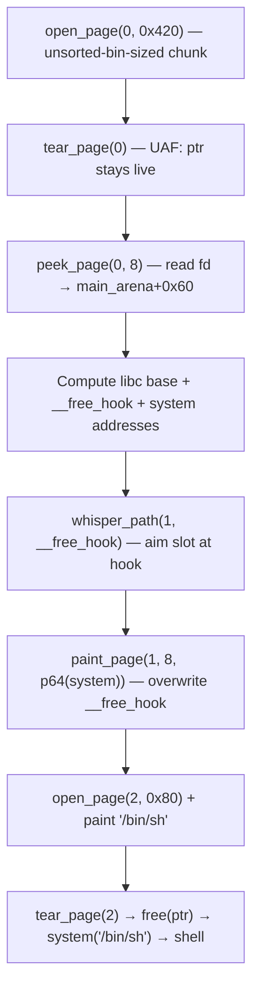

# Cider Vault — Vulnerability Report

**CTF:** BITSCTF | **Category:** Pwn | **Binary:** `cider_vault` (ELF 64-bit)
**Protections:** Full RELRO · Stack Canary · NX · PIE · FORTIFY | **GLIBC:** 2.31

---

## Executive Summary

The `cider_vault` binary exposes three independent vulnerabilities in its heap management menu. Chaining them — **Use-After-Free → libc leak**, **Arbitrary Pointer Write via XOR obfuscation**, and a **Heap Overflow** — gives full control of `__free_hook`, leading to a shell.

```
UAF (libc leak) → Whisper Write (__free_hook = system) → Tear → shell
```

---

## Data Model

```c
struct Page {       // "vats[]" in the binary, 12 slots
    void  *data;    // +0x00 — heap pointer
    size_t size;    // +0x08 — allocated size
};
```

Menu options and their underlying libc calls:

| Option | Name           | Primitive |
|--------|----------------|-----------|
| 1      | open page      | `malloc(size)` — `0x80 ≤ size ≤ 0x520` |
| 2      | paint page     | `read(0, ptr, n)` |
| 3      | peek page      | `write(1, ptr, n)` |
| 4      | tear page      | `free(ptr)` |
| 5      | stitch pages   | `realloc` + 0x20-byte SIMD copy |
| 6      | whisper path   | `ptr = input ^ 0x51F0D1CE6E5B7A91` |
| 7      | moon bell      | `_IO_wfile_overflow(stderr, 'X')` |
| 8      | goodnight      | `exit(0)` |

---

## Vulnerability 1 — Use-After-Free (CWE-416)

**Location:** option 4 ("tear page") — `free()` with no pointer null-out.

```cpp
// flow.cpp, case 4
free(pages[id].data);
// BUG: pages[id].data is never set to nullptr
```

Assembly evidence (`cider.asm`):
```asm
mov     rdi, [r13+rax+0]   ; rdi = pages[id].data
call    _free               ; free(ptr)
; no:   mov qword ptr [r13+rax+0], 0
```

**Effect:** After `free()`, the slot still holds a live dangling pointer. Options 2 (paint) and 3 (peek) both check only `!pages[id].data`, which remains non-null — so the attacker can freely **read from** or **write into** freed memory.

**Exploitation:**
1. `open_page(0, 0x420)` — allocate a chunk larger than the tcache limit (0x410), so it goes to the **unsorted bin** on free.
2. `open_page(1, 0x80)` — guard chunk to prevent top-chunk coalescing.
3. `tear_page(0)` — chunk enters the unsorted bin; `pages[0].data` still points to it.
4. `peek_page(0, 8)` — read the `fd` pointer written by ptmalloc: `main_arena + 0x60`.

```python
tear_page(0)
libc_leak    = u64(peek_page(0, 8))
libc.address = libc_leak - libc.sym.__malloc_hook - 0x70
```

---

## Vulnerability 2 — Arbitrary Pointer Write via XOR Obfuscation (CWE-822)

**Location:** option 6 ("whisper path").

```cpp
// flow.cpp, case 6
pages[id].data = (void*)(get_num() ^ 0x51F0D1CE6E5B7A91LL);
```

The obfuscation is trivially reversible: to set `pages[id].data = target`, send `input = target ^ 0x51F0D1CE6E5B7A91`.

Once `pages[id].data` points to an arbitrary address, option 2 (paint) becomes an **arbitrary write** of up to `pages[id].size + 0x80` bytes (see Vuln 3):

```python
whisper_path(1, libc.sym.__free_hook)   # aim slot 1 at __free_hook
paint_page(1, 8, p64(libc.sym.system))  # write system() there
```

> No heap validity check is performed on the new pointer — any writable address in the process is reachable.

---

## Vulnerability 3 — Heap Overflow +0x80 bytes (CWE-122)

**Location:** option 2 ("paint page") and option 3 ("peek page").

```cpp
// flow.cpp, case 2
if (ink_bytes > pages[id].size + 128)   // allows +0x80 past allocation
    { cout << "no\n"; break; }
read(0, pages[id].data, ink_bytes);
```

Assembly:
```asm
mov     rax, [rbx+8]              ; rax = pages[id].size
sub     rax, 0FFFFFFFFFFFFFF80h   ; rax += 0x80  (sub of -0x80)
cmp     r13, rax
ja      loc_1630                  ; reject only if > size+0x80
```

**Effect:** up to 128 bytes of linear heap overflow, sufficient to corrupt adjacent chunk headers. This primitive is also available on **freed chunks** via UAF, enabling chunk metadata manipulation.

---

## Exploit Chain



---

## Impact

| Property          | Detail |
|-------------------|--------|
| **Confidentiality** | Full — arbitrary memory read via peek on freed chunks |
| **Integrity**       | Full — arbitrary write to any mapped address |
| **Availability**    | Full — arbitrary code execution, shell obtained |
| **CVSS-like severity** | **Critical** |
| **Auth required** | None (local binary / remote socket) |
| **Mitigations bypassed** | PIE (via UAF leak), `__free_hook` (still writable in glibc 2.31) |

---

## Fix Recommendations

| # | Location | Fix |
|---|----------|-----|
| 1 | `case 4` (tear page) | **Null out the pointer after free:** `pages[id].data = nullptr; pages[id].size = 0;` |
| 2 | `case 2/3` (paint/peek) | **Enforce exact bounds:** reject `n > pages[id].size`, remove the `+ 128` slack |
| 3 | `case 6` (whisper path) | **Remove or gate behind authentication;** at minimum, validate the resulting pointer is within the program's own heap arena before accepting it |
| 4 | Upgrade glibc | **glibc ≥ 2.34** removes `__free_hook` entirely, eliminating this attack vector |
