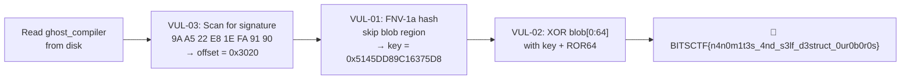

# Vulnerability Report — `ghost_compiler`

**CTF:** BITSCTF  
**Category:** Reverse Engineering  
**Binary:** `ghost_compiler` (ELF64 shared object, x86-64)  
**Severity:** Informational (CTF design — intentional "vulnerabilities")

---

## Executive Summary

`ghost_compiler` presents itself as a wrapper around `gcc`. Internally, it implements an **ouroboros self-inspection** pattern: the binary opens *itself* via `argv[0]`, derives a decryption key from its own contents, decrypts an embedded flag blob to verify authenticity, then **self-destructs** the flag region before delegating to `gcc`. Three distinct weaknesses allow an attacker to fully recover the flag without executing the binary.

---

## Vulnerability Details

### VUL-01 — Predictable Key Derived from Static Binary Content

| Field | Value |
|-------|-------|
| **Location** | `sub_14B5` (`0x14B5`) |
| **Impact** | Full flag recovery offline |
| **Exploitability** | Trivial (static analysis only) |

**Description:**  
The decryption key is a FNV-1a variant hash computed over the entire binary file, minus the 64-byte blob region (`offset 0x3020`, length `0x40`). Because the binary is a **fixed, distributed artifact**, the hash is fully deterministic and computable without ever running the program:

```
hash = FNV_1a_variant(ghost_compiler, skip=[0x3020, 0x3060))
     = 0x5145DD89C16375D8
final_key = 0xCAFEBABE00000000 XOR hash
```

An attacker with a copy of the binary can reproduce the exact key statically. There is no nonce, no secret, no runtime entropy.

---

### VUL-02 — Embedded Plaintext-Recoverable Flag Blob

| Field | Value |
|-------|-------|
| **Location** | `.data:0x4020` / file offset `0x3020` |
| **Impact** | Flag extracted by XOR with known key |
| **Exploitability** | Trivial |

**Description:**  
The flag is stored as 64 encrypted bytes directly inside the binary at a fixed, discoverable offset. The encryption is a simple stream cipher:

```python
for i in range(64):
    decrypted[i] = blob[i] ^ (key & 0xFF)
    key = ROR64(key, 1)          # rotate right 1 bit
```

XOR-based stream ciphers with a *static key* provide no semantic security. Once VUL-01 yields the key, all 64 flag bytes are immediately recoverable.

---

### VUL-03 — Magic Blob Locatable via Byte-Sequence Scan

| Field | Value |
|-------|-------|
| **Location** | `sub_1349` (`0x1349`) |
| **Impact** | Blob offset always findable; self-referencing bypassed trivially |
| **Exploitability** | Trivial |

**Description:**  
The binary locates its own blob by calling `fopen(argv[0], "rb")` and scanning each byte for the magic 8-byte signature. This signature is also static and directly searchable offline:

```
Signature: 9A A5 22 E8 1E FA 91 90  → found at file offset 0x3020
```

No obfuscation, no indirection — a simple `bytes.index()` reveals the blob.

---

### VUL-04 — Self-Destruct Ineffective Against Static / Offline Analysis

| Field | Value |
|-------|-------|
| **Location** | `main` (post-validation branch) |
| **Impact** | Self-destruct provides no real protection |
| **Exploitability** | Low (trivially avoided by static analysis) |

**Description:**  
After validating the flag prefix `"BITSCTF{"`, `main` zeros the blob via `memset` and overwrites the on-disk binary. This only affects the live file at `argv[0]`. An attacker working on a copy, or using static analysis (no execution needed), is entirely unaffected.

---

## Attack Chain



---

## Proof-of-Concept

```python
MASK64     = 0xFFFFFFFFFFFFFFFF
FNV_OFFSET = 0xCBF29CE484222325
FNV_PRIME  = 0x100000001B3
CAFEBABE   = 0xCAFEBABE00000000

def ror64(v, n):
    v &= MASK64
    return ((v >> n) | (v << (64 - n))) & MASK64

with open("ghost_compiler", "rb") as f:
    data = f.read()

# VUL-03: locate blob by signature
sig    = bytes([0x9A, 0xA5, 0x22, 0xE8, 0x1E, 0xFA, 0x91, 0x90])
offset = data.index(sig)                        # = 0x3020

# VUL-01: derive key
h = FNV_OFFSET
for pos, b in enumerate(data):
    if offset <= pos < offset + 0x40:
        continue                                # skip 64-byte blob
    h = ((h ^ b) * FNV_PRIME) & MASK64
key = (CAFEBABE ^ h) & MASK64

# VUL-02: decrypt
blob = data[offset:offset + 64]
flag = bytearray()
for b in blob:
    flag.append(b ^ (key & 0xFF))
    key = ror64(key, 1)

print(flag.split(b'\x00')[0].decode())
# BITSCTF{n4n0m1t3s_4nd_s3lf_d3struct_0ur0b0r0s}
```

---

## Root Cause Summary

| # | Root Cause | Detail |
|---|------------|--------|
| 1 | **Security through obscurity** | Entire scheme relies on the analyst not reading the binary |
| 2 | **Static key / no entropy** | Key is deterministic from binary content — no secret, no randomness |
| 3 | **Weak cipher** | XOR + bit-rotation is not a cryptographically secure primitive |
| 4 | **Ineffective self-destruct** | Overwriting the on-disk file cannot protect against copies or static analysis |

---

## Hypothetical Mitigations

| Mitigation | Effect |
|------------|--------|
| Remote key retrieval | Key never resides in binary; offline recovery impossible |
| Hardware-bound key (TPM/HSM) | Key tied to environment, not replicable |
| Asymmetric encryption | Private key never embedded; encryption is one-way |
| Binary packing / obfuscation | Raises cost of static analysis (not a fix, but a deterrent) |
