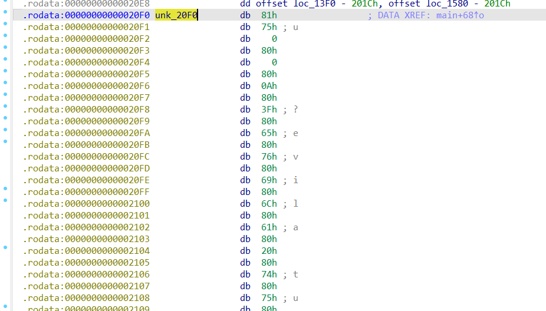

# MATRIX
### Information
* Category: Reverse Engineering
* Point: 500
* Level: Hard

### Description

Enter the M A T R I X
nc mars.picoctf.net 31259

## Solution:

Open `matrix` in `IDA`, navigate to function `main` and decompile it. We see it allocates two 2048-byte buffers and packs their pointers into `v11`. It also packs two function pointers (`sub_1320` and `sub_1340`) into `v12`. These registers are likely the VM's memory and instrucion handlers. The function then calls `sub_1350` repeatedly, executing one opcode per call. After the loop, it checks for error and `v8`. If `v8` is `0`, it opens `flag.txt` and outputs the flag.

```c
__int64 __fastcall main(int a1, char **a2, char **a3)
{
  void *v3; // r13
  void *v4; // r12
  FILE *v6; // rbp
  _BYTE v7[2]; // [rsp+Ch] [rbp-16Ch] BYREF
  unsigned __int16 v8; // [rsp+Eh] [rbp-16Ah]
  void *v9; // [rsp+10h] [rbp-168h] BYREF
  __int16 v10; // [rsp+18h] [rbp-160h]
  __m128i v11; // [rsp+20h] [rbp-158h]
  __m128i v12; // [rsp+30h] [rbp-148h]
  char s[264]; // [rsp+40h] [rbp-138h] BYREF
  unsigned __int64 v14; // [rsp+148h] [rbp-30h]

  v14 = __readfsqword(0x28u);
  setvbuf(stdout, 0, 1, 0x2000u);
  v3 = malloc(0x800u);
  v4 = malloc(0x800u);
  v9 = &unk_20F0;
  v10 = 0;
  v11 = _mm_unpacklo_epi64((__m128i)(unsigned __int64)v3, (__m128i)(unsigned __int64)v4);
  v12 = _mm_unpacklo_epi64((__m128i)(unsigned __int64)sub_1320, (__m128i)(unsigned __int64)sub_1340);
  while ( (unsigned __int8)sub_1350(&v9, v7) )
    ;
  free(v3);
  free(v4);
  if ( v7[0] )
    return 0xFFFFFFFFLL;
  if ( !v8 )
  {
    puts("Have a flag!");
    v6 = fopen("flag.txt", "r");
    fgets(s, 256, v6);
    fclose(v6);
    puts(s);
  }
  return v8;
}
```

Continue inspecting `sub_1320` and `sub_1340`, we found out that they return `getc` and `putc`. So to get the flag, we have to provide valid input so that the VM halts cleanly, therefore setting `v8` to `0`.

```c
int sub_1320()
{
  return getc(stdin);
}

int __fastcall sub_1340(unsigned __int8 a1)
{
  return putc(a1, stdout);
}
```

Examine `sub_1350`, we find out that it is a VM interpreter that reads and executes a custom bytecode, returning `1` to continue or `0` to stop. It executes `v7`, which is computed by a bytecode base (`v3` - `v9` from `main`) and a instruction pointer (`v4` - `v10` from `main`).

```c
__int64 __fastcall sub_1350(__int64 *a1, __int64 a2)
{
  __int64 v3; // rdi
  __int64 v4; // rax
  unsigned __int16 v5; // cx
  __int64 v6; // rdx
  unsigned __int8 v7; // al
  __int64 v8; // rax
  __int64 v9; // rdi
  __int64 result; // rax
  __int16 v11; // dx
  __int16 v12; // cx
  _WORD *v13; // rax
  __int64 v14; // rax
  bool v15; // sf
  __int16 v16; // cx
  __int64 v17; // rdx
  __int64 v18; // rcx
  __int64 v19; // rax
  __int16 v20; // dx
  __int64 v21; // rax
  __int16 v22; // dx
  _WORD *v23; // rdx
  _WORD *v24; // rax
  _WORD *v25; // rax
  __int16 v26; // dx
  _WORD *v27; // rdx
  _WORD *v28; // rax
  __int16 *v29; // rdx
  __int16 v30; // ax
  __int64 v31; // rax
  bool v32; // zf
  __int64 v33; // rax
  __int64 v34; // rax
  bool v35; // cc
  __int64 v36; // rax
  __int16 v37; // dx
  unsigned __int8 v38; // al
  _WORD *v39; // rdx

  v3 = *a1;
  v4 = *((unsigned __int16 *)a1 + 4);
  v5 = v4 + 1;
  v6 = v4;
  *((_WORD *)a1 + 4) = v4 + 1;
  v7 = *(_BYTE *)(v3 + v4);
  switch ( v7 )
  {
    case 0u:
      return 1;
    case 1u:
      result = 0;
      if ( a2 )
      {
        v17 = a1[2];
        *(_BYTE *)a2 = 0;
        v18 = v17 - 2;
        LOWORD(v17) = *(_WORD *)(v17 - 2);
        a1[2] = v18;
        *(_WORD *)(a2 + 2) = v17;
      }
      return result;
    case 2u:
    case 3u:
    case 4u:
    case 5u:
    case 6u:
    case 7u:
    case 8u:
    case 9u:
    case 0xAu:
    case 0xBu:
    case 0xCu:
    case 0xDu:
    case 0xEu:
    case 0xFu:
    case 0x15u:
    case 0x16u:
    case 0x17u:
    case 0x18u:
    case 0x19u:
    case 0x1Au:
    case 0x1Bu:
    case 0x1Cu:
    case 0x1Du:
    case 0x1Eu:
    case 0x1Fu:
    case 0x22u:
    case 0x23u:
    case 0x24u:
    case 0x25u:
    case 0x26u:
    case 0x27u:
    case 0x28u:
    case 0x29u:
    case 0x2Au:
    case 0x2Bu:
    case 0x2Cu:
    case 0x2Du:
    case 0x2Eu:
    case 0x2Fu:
      goto LABEL_11;
    case 0x10u:
      v25 = (_WORD *)a1[2];
      v26 = *(v25 - 1);
      a1[2] = (__int64)(v25 + 1);
      *v25 = v26;
      return 1;
    case 0x11u:
      a1[2] -= 2;
      return 1;
    case 0x12u:
      v36 = a1[2];
      v37 = *(_WORD *)(v36 - 4) + *(_WORD *)(v36 - 2);
      a1[2] = v36 - 2;
      *(_WORD *)(v36 - 4) = v37;
      return 1;
    case 0x13u:
      v19 = a1[2];
      v20 = *(_WORD *)(v19 - 4) - *(_WORD *)(v19 - 2);
      a1[2] = v19 - 2;
      *(_WORD *)(v19 - 4) = v20;
      return 1;
    case 0x14u:
      v21 = a1[2];
      v22 = *(_WORD *)(v21 - 4);
      *(_WORD *)(v21 - 4) = *(_WORD *)(v21 - 2);
      a1[2] = v21;
      *(_WORD *)(v21 - 2) = v22;
      return 1;
    case 0x20u:
      v23 = (_WORD *)(a1[2] - 2);
      a1[2] = (__int64)v23;
      LOWORD(v23) = *v23;
      v24 = (_WORD *)a1[3];
      a1[3] = (__int64)(v24 + 1);
      *v24 = (_WORD)v23;
      return 1;
    case 0x21u:
      v27 = (_WORD *)(a1[3] - 2);
      a1[3] = (__int64)v27;
      LOWORD(v27) = *v27;
      v28 = (_WORD *)a1[2];
      a1[2] = (__int64)(v28 + 1);
      *v28 = (_WORD)v27;
      return 1;
    case 0x30u:
      v29 = (__int16 *)(a1[2] - 2);
      v30 = *v29;
      a1[2] = (__int64)v29;
      *((_WORD *)a1 + 4) = v30;
      return 1;
    case 0x31u:
      v31 = a1[2];
      v32 = *(_WORD *)(v31 - 4) == 0;
      v16 = *(_WORD *)(v31 - 2);
      a1[2] = v31 - 4;
      if ( v32 )
        goto LABEL_25;
      return 1;
    case 0x32u:
      v33 = a1[2];
      v32 = *(_WORD *)(v33 - 4) == 0;
      v16 = *(_WORD *)(v33 - 2);
      a1[2] = v33 - 4;
      if ( !v32 )
        goto LABEL_25;
      return 1;
    case 0x33u:
      v14 = a1[2];
      v15 = *(__int16 *)(v14 - 4) < 0;
      v16 = *(_WORD *)(v14 - 2);
      a1[2] = v14 - 4;
      if ( !v15 )
        return 1;
      goto LABEL_25;
    case 0x34u:
      v34 = a1[2];
      v35 = *(_WORD *)(v34 - 4) <= 0;
      v16 = *(_WORD *)(v34 - 2);
      a1[2] = v34 - 4;
      if ( !v35 )
        return 1;
LABEL_25:
      *((_WORD *)a1 + 4) = v16;
      return 1;
    default:
      if ( v7 == 0xC0 )
      {
        v38 = ((__int64 (__fastcall *)(__int64, __int64, __int64))a1[4])(v3, a2, v6);
        v39 = (_WORD *)a1[2];
        a1[2] = (__int64)(v39 + 1);
        *v39 = v38;
        return 1;
      }
      if ( v7 > 0xC0u )
      {
        if ( v7 == 0xC1 )
        {
          v8 = a1[2];
          v9 = *(unsigned __int8 *)(v8 - 2);
          a1[2] = v8 - 2;
          ((void (__fastcall *)(__int64))a1[5])(v9);
          return 1;
        }
        goto LABEL_11;
      }
      if ( v7 == 0x80 )
      {
        v11 = v6 + 2;
        v12 = *(char *)(v3 + v5);
        goto LABEL_10;
      }
      if ( v7 == 0x81 )
      {
        v11 = v6 + 3;
        v12 = *(_WORD *)(v3 + v5);
LABEL_10:
        v13 = (_WORD *)a1[2];
        *((_WORD *)a1 + 4) = v11;
        a1[2] = (__int64)(v13 + 1);
        *v13 = v12;
        return 1;
      }
LABEL_11:
      result = 0;
      if ( a2 )
        *(_BYTE *)a2 = 1;
      return result;
  }
}
```

Here are the instructions of the VM base on the code:

| Opcode | Instruction | Description |
|:------:|:-----------:|:-----------:|
| 0x00 | nop | No operation |
| 0x01 | halt | Stops the VM, sets `v7[0]` (`a2`) to 0, writes the 16-bit value into `v8` (`*(_WORD *)(a2 + 2)`) |
| 0x10 | dup | Duplicates the top value on the stack |
| 0x11 | pop | Pops the top value from the stack |
| 0x12 | add | Add two values |
| 0x13 | sub | Sub two values |
| 0x14 | swap | Swap two values |
| 0x20 | push_r | Moves a value from the Data Stack (`(_WORD *)(a1[2] - 2)`) to the Return Stack (`(_WORD *)a1[3]`) |
| 0x21 | pop_r | Moves a value from the Return Stack (`(_WORD *)(a1[3] - 2)`) to the Data Stack (`(_WORD *)a1[2]`) |
| 0x30 | jmp | Jumps to an address |
| 0x31 | jz | Jump if zero |
| 0x32 | jnz | Jump if not zero |
| 0x33 | jneg | Jump if negative |
| 0x34 | jle | Jump if less than or equal zero |
| 0xC0 | getc | Read input (`sub_1320`) |
| 0xC1 | putc | Print output (`sub_1340`) |
| 0x80 | push_b | Pushes an 8-bit immediate (`*(char *)(v3 + v5)`) from bytecode to the Data Stack (`(_WORD *)a1[2]`) |
| 0x81 | push_w | Pushes the next 16-bit word (`*(_WORD *)(v3 + v5)`) from the bytecode stream onto the Data Stack (`(_WORD *)a1[2]`) |

Since `sub_1350` takes in `v9` (which is `unk_20F0`), we double click on it and come to a memory region that likely contains the VM's bytecodes because it has the opcodes that we have analyzed earlier. I have collected it and stored it in `bytecode.bin`.



With the bytecodes and opcodes, we can now make a disassembler to disassemble the VM.

```py
import re

with open("bytecode.bin", "r") as file:
    bytecode = file.readlines()

opcodes = {
    0x00: ("nop", 0),
    0x01: ("halt", 0),
    0x10: ("dup", 0),
    0x11: ("pop", 0),
    0x12: ("add", 0),
    0x13: ("sub", 0),
    0x14: ("swap", 0),
    0x20: ("push_r", 0),
    0x21: ("pop_r", 0),
    0x30: ("jmp", 0),
    0x31: ("jz", 0),
    0x32: ("jnz", 0),
    0x33: ("jneg", 0),
    0x34: ("jle", 0),
    0x80: ("push_b", 1),
    0x81: ("push_w", 2),
    0xC0: ("getc", 0),
    0xC1: ("putc", 0),
}

def parse_byte(line):
    byte = re.search(r'\bdb\s+([0-9A-Fa-fh]+)', line).group(1)

    if byte.lower().endswith("h"):
        return int(byte[:-1], 16)

    return int(byte)

bytecodes = []

for line in bytecode:
    bytecodes.append(parse_byte(line))

cnt = 0
output = []
output.append("Address\tOpcode\tInstruction\t\tOperand")

while cnt < len(bytecodes):
    opcode = bytecodes[cnt]
    name, operand_size = opcodes.get(opcode)
    operand = ""
    operand_int = 0

    if operand_size == 1:
        operand_int = bytecodes[cnt + 1]
        operand = f"0x{operand_int:02X}"
    elif operand_size == 2:
        low = bytecodes[cnt + 1]
        high = bytecodes[cnt + 2]
        operand_int = low | (high << 8) # little endian
        operand = f"0x{operand_int:04X}"

    if 32 <= operand_int <= 126:
        operand = f"{operand}\t'{chr(operand_int)}'"
    elif operand_int == 0x0A:
        operand = f"{operand}\t'\\n'"

    output.append(f"0x{cnt:04X}\t0x{opcode:02X}\t{name}\t\t\t{operand}")

    cnt += 1 + operand_size

output = "\n".join(output)

with open("disassembled.asm", "w") as file:
    file.write(output)
```

Run the script and we got the asm in `disassembled.asm`. Because this asm code is quite long, i will try to explain it part by part. At first, it pushes each word of a string `Welcome to the M A T R I X\nCan you make it out alive?\n` and prints it by making a jump to `0x013B`, which contains `putc`.

```asm
Address	Opcode	Instruction		Operand
0x0000	0x81	push_w			0x0075	'u'
0x0003	0x80	push_b			0x00
0x0005	0x80	push_b			0x0A	'\n'
0x0007	0x80	push_b			0x3F	'?'
0x0009	0x80	push_b			0x65	'e'
0x000B	0x80	push_b			0x76	'v'
0x000D	0x80	push_b			0x69	'i'
0x000F	0x80	push_b			0x6C	'l'
0x0011	0x80	push_b			0x61	'a'
0x0013	0x80	push_b			0x20	' '
0x0015	0x80	push_b			0x74	't'
0x0017	0x80	push_b			0x75	'u'
0x0019	0x80	push_b			0x6F	'o'
0x001B	0x80	push_b			0x20	' '
0x001D	0x80	push_b			0x74	't'
0x001F	0x80	push_b			0x69	'i'
0x0021	0x80	push_b			0x20	' '
0x0023	0x80	push_b			0x65	'e'
0x0025	0x80	push_b			0x6B	'k'
0x0027	0x80	push_b			0x61	'a'
0x0029	0x80	push_b			0x6D	'm'
0x002B	0x80	push_b			0x20	' '
0x002D	0x80	push_b			0x75	'u'
0x002F	0x80	push_b			0x6F	'o'
0x0031	0x80	push_b			0x79	'y'
0x0033	0x80	push_b			0x20	' '
0x0035	0x80	push_b			0x6E	'n'
0x0037	0x80	push_b			0x61	'a'
0x0039	0x80	push_b			0x43	'C'
0x003B	0x80	push_b			0x0A	'\n'
0x003D	0x80	push_b			0x58	'X'
0x003F	0x80	push_b			0x20	' '
0x0041	0x80	push_b			0x49	'I'
0x0043	0x80	push_b			0x20	' '
0x0045	0x80	push_b			0x52	'R'
0x0047	0x80	push_b			0x20	' '
0x0049	0x80	push_b			0x54	'T'
0x004B	0x80	push_b			0x20	' '
0x004D	0x80	push_b			0x41	'A'
0x004F	0x80	push_b			0x20	' '
0x0051	0x80	push_b			0x4D	'M'
0x0053	0x80	push_b			0x20	' '
0x0055	0x80	push_b			0x65	'e'
0x0057	0x80	push_b			0x68	'h'
0x0059	0x80	push_b			0x74	't'
0x005B	0x80	push_b			0x20	' '
0x005D	0x80	push_b			0x6F	'o'
0x005F	0x80	push_b			0x74	't'
0x0061	0x80	push_b			0x20	' '
0x0063	0x80	push_b			0x65	'e'
0x0065	0x80	push_b			0x6D	'm'
0x0067	0x80	push_b			0x6F	'o'
0x0069	0x80	push_b			0x63	'c'
0x006B	0x80	push_b			0x6C	'l'
0x006D	0x80	push_b			0x65	'e'
0x006F	0x80	push_b			0x57	'W'
0x0071	0x81	push_w			0x013B
```
```
0x013B	0x10	dup			
0x013C	0x81	push_w			0x0145
0x013F	0x31	jz			
0x0140	0xC1	putc	
```
```py
// psuedo code (python):
putc("Welcome to the M A T R I X\nCan you make it out alive?\n")
```

Next, it calls `getc` and waits for user's input. Then it checks whether the input is `u`, `d`, `l`, or `r`. If not, it jumps to `0x00FB`, which prints `You were eaten by a grue.\n` and halts the VM, setting `v8` to `1` (it pushed `1` on top of the stack then halts).

```
0x0075	0x80	push_b			0x01
0x0077	0x80	push_b			0x01
0x0079	0x80	push_b			0x00
0x007B	0xC0	getc			
0x007C	0x10	dup			
0x007D	0x80	push_b			0x75	'u'
0x007F	0x13	sub			
0x0080	0x81	push_w			0x00A0
0x0083	0x31	jz			
0x0084	0x10	dup			
0x0085	0x80	push_b			0x64	'd'
0x0087	0x13	sub			
0x0088	0x81	push_w			0x00AA
0x008B	0x31	jz			
0x008C	0x10	dup			
0x008D	0x80	push_b			0x6C	'l'
0x008F	0x13	sub			
0x0090	0x81	push_w			0x00B4
0x0093	0x31	jz			
0x0094	0x10	dup			
0x0095	0x80	push_b			0x72	'r'
0x0097	0x13	sub			
0x0098	0x81	push_w			0x00C0
0x009B	0x31	jz			
0x009C	0x81	push_w			0x00FB
0x009F	0x30	jmp		
```
```
0x00FB	0x81	push_w			0x0138
0x00FE	0x80	push_b			0x00
0x0100	0x80	push_b			0x0A	'\n'
0x0102	0x80	push_b			0x2E	'.'
0x0104	0x80	push_b			0x65	'e'
0x0106	0x80	push_b			0x75	'u'
0x0108	0x80	push_b			0x72	'r'
0x010A	0x80	push_b			0x67	'g'
0x010C	0x80	push_b			0x20	' '
0x010E	0x80	push_b			0x61	'a'
0x0110	0x80	push_b			0x20	' '
0x0112	0x80	push_b			0x79	'y'
0x0114	0x80	push_b			0x62	'b'
0x0116	0x80	push_b			0x20	' '
0x0118	0x80	push_b			0x6E	'n'
0x011A	0x80	push_b			0x65	'e'
0x011C	0x80	push_b			0x74	't'
0x011E	0x80	push_b			0x61	'a'
0x0120	0x80	push_b			0x65	'e'
0x0122	0x80	push_b			0x20	' '
0x0124	0x80	push_b			0x65	'e'
0x0126	0x80	push_b			0x72	'r'
0x0128	0x80	push_b			0x65	'e'
0x012A	0x80	push_b			0x77	'w'
0x012C	0x80	push_b			0x20	' '
0x012E	0x80	push_b			0x75	'u'
0x0130	0x80	push_b			0x6F	'o'
0x0132	0x80	push_b			0x59	'Y'
0x0134	0x81	push_w			0x013B
0x0137	0x30	jmp			
0x0138	0x80	push_b			0x01
0x013A	0x01	halt			
```
```py
// psuedo code (python):
user_input = getc()
if user_input == 'u':
    jump(0x00A0)
elif user_input == 'd':
    jump(0x00AA)
elif user_input == 'l':
    jump(0x00B4)
elif user_input == 'r':
    jump(0x00C0)
else:
    putc("You were eaten by a grue.\n")
    halt(1)
```

After checking valid move and handle the movement, it jumps to `0x00CC` to validate the player's position. At `0x00CC`, it takes in `Y`, pushes it into a loop that run `16` times, which calculates `Y * 16`, then uses that value to add to `X`. We call it `a` for clarity, the vm then jumps to `0x0161` to multiply `a` by `4` then adds it to `0x0174` (which is map's base address). Overall, we have a formula that gives us the position of a player which is `(X + (Y * 16)) * 4 + 0x0174` because the map is stored as 1D array in memory. Since including part of the `asm` code in here will make the write-up too long so I will incluce a psuedo code.

```py
// psuedo code (python):
def get_player_position(x, y):
    map_width = 16 # since y is multiply with 16 
    map_base_address = 0x0174
    map_jump_entry_size = 4 # push_w takes 1 byte, operand takes 2 bytes, and jmp takes 1 byte

    return (x + (y * map_width)) * map_jump_entry_size + map_base_address
```

From the formula we know that the map is 16 in width, now we need to find its height. We know that the map's data begins at `0x0174`, inspecting the asm code we see that it ends at `0x0574`. So the total size of the map is `0x0574 - 0x0174` = `0x400` bytes, which is `1024` in demical. Each jump takes 4 bytes, so the total cells of the map is `1024/4` = `256` cells. We have `total_cells = width * height` so we got the map's heigth which is `16` also. Further exploring the map's data, we observe that it makes a jump to some special addresses, which are `0x057F` (add 1 to a value on the stack), `0x0574` (sub 1 from a value, and perform a check, if that checks failed it jump to `0x00FB`). We assume that `0x057F` add 1 health to the player, while `0x0574` sub 1 health and check whether the player's health is > 0, if not it halts the VM, therefore exits the game. There are also many `nop` instructions with `jmp`, indicating the valid path that the player can move, and specially, an address `0x0585`, which prints "Congratulations, you made it!\n", we know that this is the exit of the map. With all the information we have analyze, we can make a script that extract the map for us. The player should be at the start of the map.

```py
import re

with open("disassembled.asm", "r") as file:
    disassembled = file.readlines()

map_width = 16
map_height = 16
map_base_address = 0x0174
map_jump_entry_size = 4

wall = 0x00FB
exit = 0x0585
trap = 0x0574
health = 0x057F

start_x, start_y = 1, 1

# get the instructions

instructions = {}
line_regex = re.compile(r"^(0x[0-9a-fA-F]+)\s+0x[0-9a-fA-F]+\s+([a-z_]+)\s*(.*)$")

for line in disassembled:
    match = line_regex.match(line)
    if match:
        address_string, instruction, operand = match.groups()
        address = int(address_string, 16)

        operand_match = re.search(r"0x[0-9a-fA-F]+", operand)
        operand = int(operand_match.group(0), 16) if operand_match else None

        instructions[address] = (instruction, operand)

# get the map

map = [[' ' for _ in range(map_width)] for _ in range(map_height)]
for y in range(map_height):
    for x in range(map_width):
        address = map_base_address + (y * map_width + x) * map_jump_entry_size
        instruction, operand = instructions[address]

        if instruction == 'push_w' and operand:
            if operand == wall:
                map[y][x] = '#'
            elif operand == exit:
                map[y][x] = 'E'
            elif operand == health:
                map[y][x] = '+'
            elif operand == trap:
                map[y][x] = '-'
        elif instruction == 'jmp': # nop instruction does nothing, thats why it jumps to it :D
            map[y][x] = '.'

map[start_x][start_y] = 'S'

# print the map

for row in map:
    print("".join(row))
```

Run the script and we got our map:

```
################
#S....+#.#+..#.#
####-###.###.#.#
#..........#.#.#
##.#.#####.#.-.#
#..#.#+..#.#.#.#
#.##.###.#.#.#.#
#.#......#.#.#.#
#.#.######.#.#.#
#.#........#.#.#
#.###.######.#.#
#...#..-..#..#.#
#.###..#..#.#..#
#.#...###.#.#-##
#.#....#..-.#..#
##############E#
```

We now know the gameplay (try to escape the matrix with health > 0), and the health can be taken multiple times, we can make a script for this too :D, thx gemini for this (im bad at this:( )

```py
import collections

# The maze for this problem.
maze_string = """
################
#S....+#.#+..#.#
####-###.###.#.#
#..........#.#.#
##.#.#####.#.-.#
#..#.#+..#.#.#.#
#.##.###.#.#.#.#
#.#......#.#.#.#
#.#.######.#.#.#
#.#........#.#.#
#.###.######.#.#
#...#..-..#..#.#
#.###..#..#.#..#
#.#...###.#.#-##
#.#....#..-.#..#
##############E#
"""

def solve_maze_with_health(maze_str):
    """
    Solves the maze using BFS, where state is determined by position and health.
    Returns the optimal path as a list of coordinates, or None if no solution exists.
    """
    grid = [list(row) for row in maze_str.strip().split('\n')]
    height = len(grid)
    width = len(grid[0])

    # --- 1. Find the start and end positions ---
    start_pos, end_pos = None, None
    for r in range(height):
        for c in range(width):
            if grid[r][c] == 'S':
                start_pos = (r, c)
            elif grid[r][c] == 'E':
                end_pos = (r, c)
    
    # --- 2. Initialize the BFS ---
    # Starting health is 0
    initial_health = 0
    
    # State in the queue: (position, path_taken, current_health)
    queue = collections.deque([(start_pos, [start_pos], initial_health)])

    # Visited state optimization: store the max health achieved at each position.
    # visited[position] = max_health
    visited = {start_pos: initial_health}

    # --- 3. Run the BFS loop ---
    while queue:
        (r, c), path, health = queue.popleft()

        # --- Goal Condition ---
        if (r, c) == end_pos:
            return path

        # --- Explore Neighbors ---
        for dr, dc in [(-1, 0), (1, 0), (0, -1), (0, 1)]: # Up, Down, Left, Right
            nr, nc = r + dr, c + dc

            if not (0 <= nr < height and 0 <= nc < width):
                continue
            
            neighbor_char = grid[nr][nc]
            
            if neighbor_char == '#':
                continue

            # --- Calculate the new health for the neighbor state ---
            new_health = health
            if neighbor_char == '+':
                new_health += 1
            elif neighbor_char == '-':
                new_health -= 1

            # Rule: Health cannot drop below zero. This is an invalid move.
            if new_health < 0:
                continue
            
            new_pos = (nr, nc)
            
            # Optimization: If we've been here before with more or equal health,
            # this new path is not better. Prune it.
            if new_pos in visited and visited[new_pos] >= new_health:
                continue

            # This is a new best path to this position.
            # Record it and add it to the queue for exploration.
            visited[new_pos] = new_health
            new_path = path + [new_pos]
            queue.append((new_pos, new_path, new_health))
    
    return None # No solution found

def path_to_moves_string(path):
    """
    Converts a list of coordinates (the path) into a string of moves.
    """
    if not path or len(path) < 2:
        return ""
    
    moves = []
    move_map = {
        (-1, 0): 'u', (1, 0): 'd', (0, -1): 'l', (0, 1): 'r'
    }

    for i in range(1, len(path)):
        prev_r, prev_c = path[i-1]
        curr_r, curr_c = path[i]
        dr, dc = curr_r - prev_r, curr_c - prev_c
        moves.append(move_map.get((dr, dc), '?'))

    return "".join(moves)

if __name__ == "__main__":
    solution_path = solve_maze_with_health(maze_string)
    
    if solution_path:
        move_string = path_to_moves_string(solution_path)
        print(f"Solution found! Path length: {len(move_string)} steps.")
        print("\nMoves:")
        print(move_string)
    else:
        print("Could not find a valid path to the exit.")
```

Run the script, we got the string `rrrrrlrlrlrlrllddddddlddrrddrrrdrddrruuuruuuuuuurrddddddddlddrd`. Submit the string and we got our flag `picoCTF{y0uv3_3sc4p3d_th3_m4ze...f0r_n0w-hYkq2D9PmrA5GpEq}`.


## Additional note:
In this write-up i follow this path: static analyse to get the vm's structure -> write a disassembler for it -> then static analyse the asm code. You can follow a different path: static analyse to get the vm's structure -> write a vm's emulator for it -> debugging the emulator to solve the challenge.