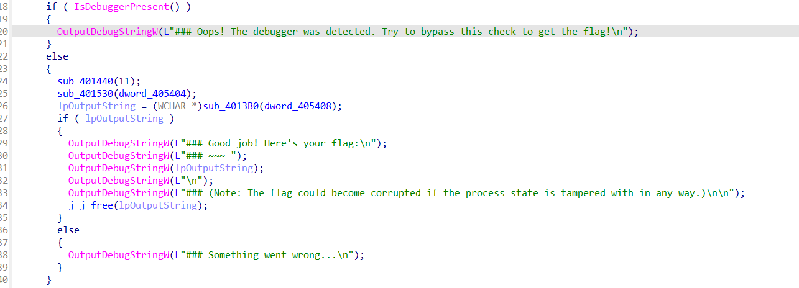
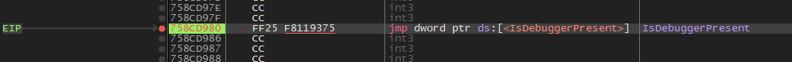
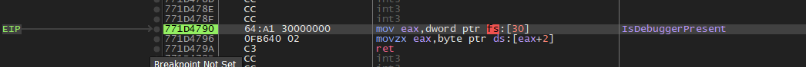
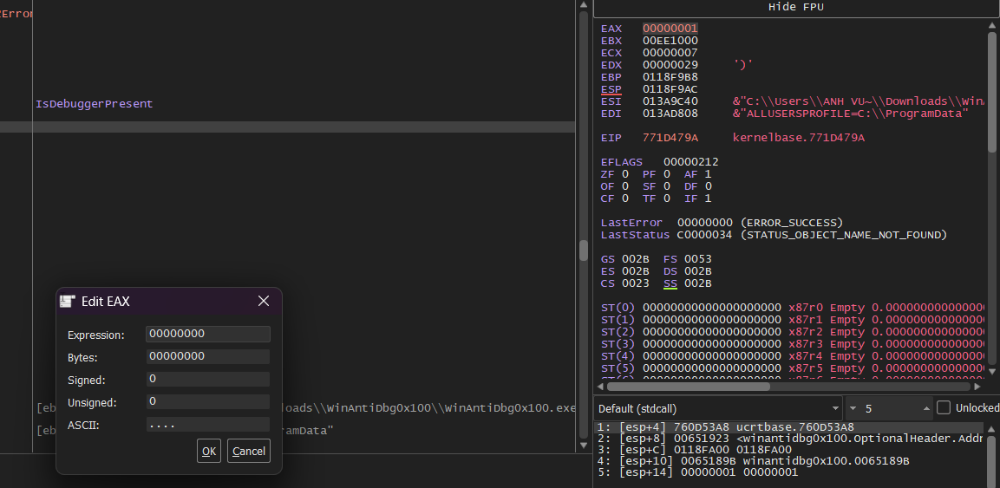
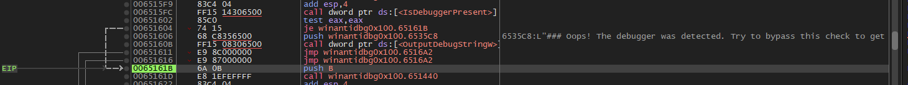
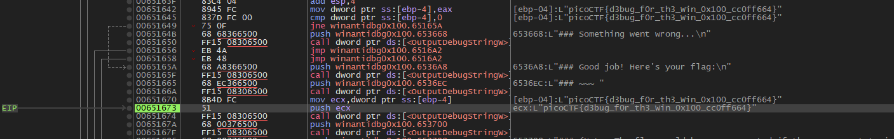

# WinAntiDbg0x100
### Information
* Category: Reverse Engineering
* Point: 200
* Level: Medium

### Description
This challenge will introduce you to 'Anti-Debugging.' Malware developers don't like it when you attempt to debug their executable files because debugging these files reveals many of their secrets! That's why, they include a lot of code logic specifically designed to interfere with your debugging process.
Now that you've understood the context, go ahead and debug this Windows executable!
This challenge binary file is a Windows console application and you can start with running it using cmd on Windows.
Challenge can be downloaded here. Unzip the archive with the password picoctf

## Solution:

Run `WinAntiDbg0x100.exe` in cmd, we see that this application needs to be opened in a debugger.

Open it in IDA, navigate to function `main` and decompile it. We found that the program calls `IsDebuggerPresent` function from WinAPI to check whether a debugger is attached to it. So to get the flag, we need to bypass the check by changing the return value to `false`.

Open `WinAntiDbg0x100.exe` in x32dbg, go to tab `Symbols`, select `kernel32.dll` since this contains function `IsDebuggerPresent`, we will place a breakpoint on it.

Press `F9` to run the application until a breakpoint is hit.

Press `F7` to step into the function. We can see that it puts a value in `eax` register and returns it. Since our goal is to make the function returns `false`, we will change the value of `eax` to `0`.

Press `F8` to step over until `ret` code, we can see that `eax` contains value `1`. We will change it to `0`.

Press `F8` for the program to continue running, we can see that it jumps over the detection message now, confirming that our patch worked!

Keep pressing `F8` until we see a flag `picoCTF{d3bug_f0r_th3_Win_0x100_cc0ff664}` appears and we are done! The flag is not output in the console because the application uses function `OutputDebugStringW` to send texts to any debugger that it attaches to.

