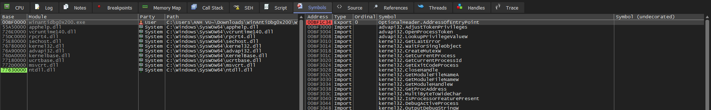
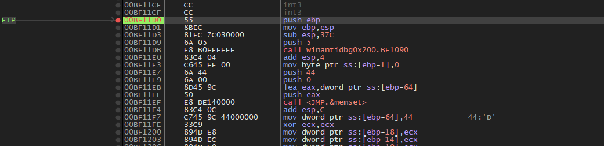
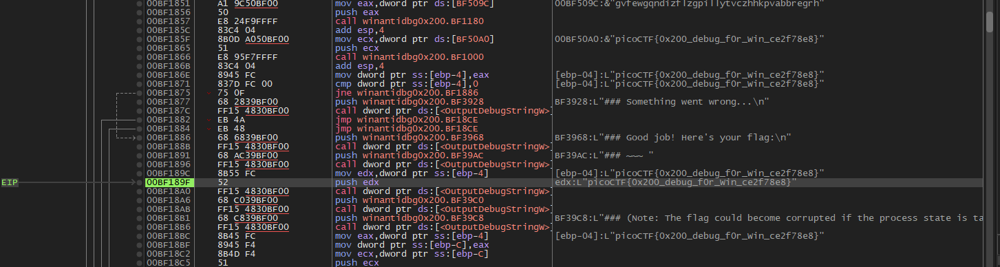

# WinAntiDbg0x200
### Information
* Category: Reverse Engineering
* Point: 300
* Level: Medium

### Description
If you have solved WinAntiDbg0x100, you'll discover something new in this one. Debug the executable and find the flag!
This challenge executable is a Windows console application, and you can start by running it using Command Prompt on Windows.
This executable requires admin privileges. You might want to start Command Prompt or your debugger using the 'Run as administrator' option.
Challenge can be downloaded here. Unzip the archive with the password picoctf

## Solution:

Open `WinAntiDbg0x200.exe` in IDA, navigate to function `_main`. We see that the author added new function `sub_4011D0` that checks for a debugger beside `IsDebuggerPresent` function.


Decompile `sub_4011D0`, we observe that it spawns a child process, pass its PID to it, and checks the child's exit code. If the exit code is `48879` (means that the child was not getting debugged) or it couldn't spawn a child process, the function returns `1`, indicating that a debugger is detected. Overall, this method assumes that a debugger can only attach to the parent process, not its newly spawned child. To bypass this, we will need to make it returns `0`.

```c
char sub_4011D0()
{
  WCHAR Filename[260]; // [esp+0h] [ebp-37Ch] BYREF
  CHAR CommandLine[272]; // [esp+208h] [ebp-174h] BYREF
  _STARTUPINFOA StartupInfo; // [esp+318h] [ebp-64h] BYREF
  DWORD CurrentProcessId; // [esp+360h] [ebp-1Ch]
  _PROCESS_INFORMATION ProcessInformation; // [esp+364h] [ebp-18h] BYREF
  DWORD ExitCode; // [esp+374h] [ebp-8h] BYREF
  char v8; // [esp+37Bh] [ebp-1h]

  sub_401090(5);
  v8 = 0;
  memset(&StartupInfo, 0, sizeof(StartupInfo));
  StartupInfo.cb = 68;
  memset(&ProcessInformation, 0, sizeof(ProcessInformation));
  ExitCode = 0;
  CurrentProcessId = GetCurrentProcessId();
  GetModuleFileNameW(0, Filename, 0x104u);
  snprintf(CommandLine, 0x110u, "%ws %d", Filename, CurrentProcessId);
  if ( CreateProcessA(0, CommandLine, 0, 0, 0, 0, 0, 0, &StartupInfo, &ProcessInformation) )
  {
    WaitForSingleObject(ProcessInformation.hProcess, 0xFFFFFFFF);
    sub_401090(4);
    GetExitCodeProcess(ProcessInformation.hProcess, &ExitCode);
    CloseHandle(ProcessInformation.hProcess);
    CloseHandle(ProcessInformation.hThread);
    sub_401090(4);
    if ( ExitCode == 48879 )
      return 1;
    return v8;
  }
  else
  {
    OutputDebugStringW(L"### [ERROR] Unable to create the child process. Assuming a debugger messed with it.\n");
    return 1;
  }
}
```

Since the program needs to be opened in `Administrator mode`, we will open `x32dbg` with that (not because I think this is easier that patching this check also :D).


Open the program in `x32dbg` (`Administrator mode` ofcourse), go to `Symbols` tab, double click in `winantidbg0x200.exe` (because `sub_4011D0` exists in the main thread of the program, not from any library) to go to its memory region, it will redirect us to `CPU` tab.



From IDA we know that function `sub_4011D0` has offset `0x11D0`, so we will locate and place a breakpoint on it. In this case, the function is located at `00BF11D0`.



Press `F9` for the application to run until the breakpoint is hit. Use `F8` to step over until the `ret` code, we can see `eax` holds value `1`, change it to `0`.


For function `IsDebuggerPresent`, we do just like `WinAntiDbg0x100` and got our flag `picoCTF{0x200_debug_f0r_Win_ce2f78e8}`.




