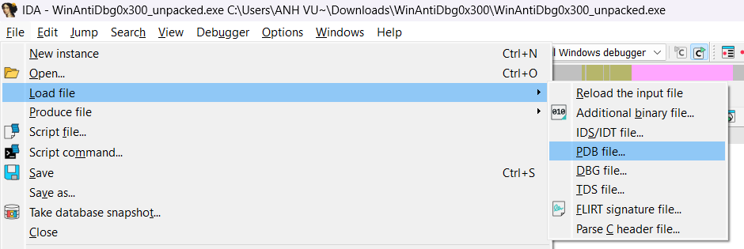
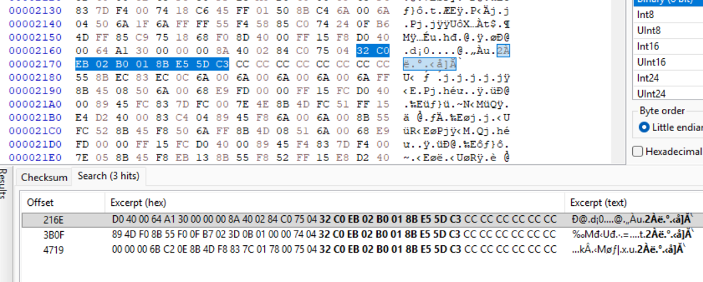
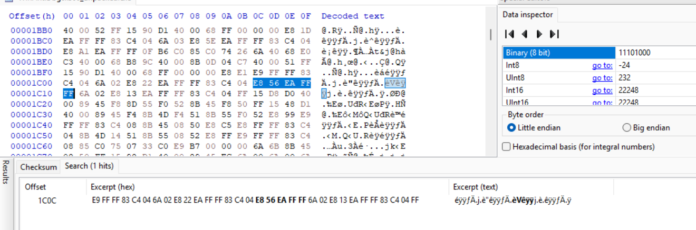
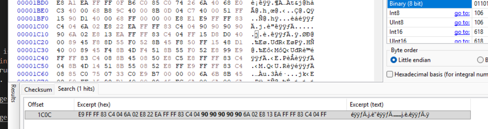
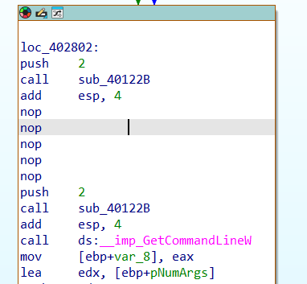
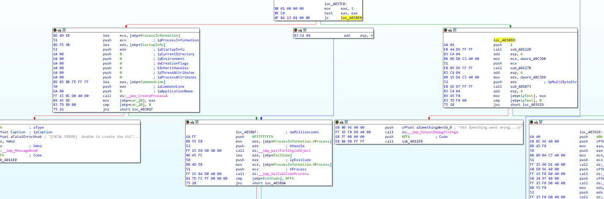
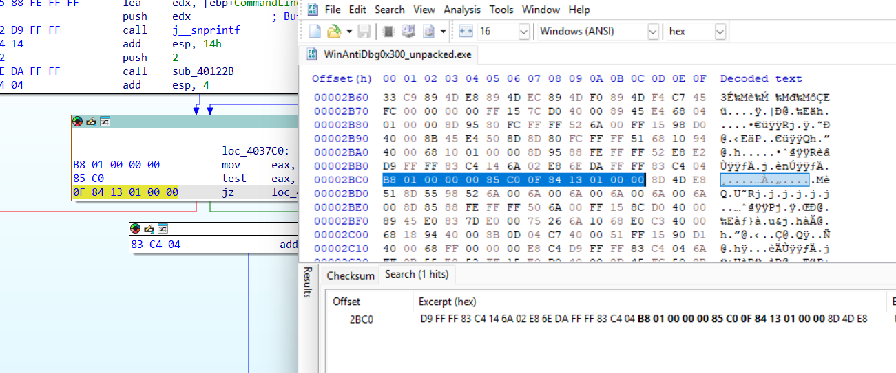

# WinAntiDbg0x300
### Information
* Category: Reverse Engineering
* Point: 400
* Level: Medium

### Description
This challenge is a little bit invasive. It will try to fight your debugger. With that in mind, debug the binary and get the flag!
This challenge executable is a GUI application and it requires admin privileges. And remember, the flag might get corrupted if you mess up the process's state.
Challenge can be downloaded here. Unzip the archive with the password picoctf
If you get "VCRUNTIME140D.dll" and "ucrtbased.dll" missing error, then that means the Universal C Runtime library and Visual C++ Debug library are not installed on your Windows machine.
The quickest way to fix this is:
Download Visual Studio Community installer from https://visualstudio.microsoft.com/vs/community/
After the installer starts, first select 'Desktop development with C++' and then, in the right side column, select 'MSVC v143 - VS 2022 C++ x64/x86 build tools' and 'Windows 11 SDK' packages.
This will take ~30 mins to install any missing DLLs.

### Hint

- There is an infinite loop to constantly check for the debugger.
- Get past that infinite loop. Maybe 'Patch' the binary to jump to the appropriate location?
- If you've done everything correctly, the flag should pop-up on your screen after 5 seconds of launching the program. The flag will also be printed to the Debug output to make it easy for you to copy the flag to the clipboard. See 'DebugView' program in Sysinternals Suite.

## Solution:

Open `WinAntiDbg0x300.exe` in `DIE`, we see that it is packed with `UPX`.


We use this command to decompress it.

```bash
upx -d WinAntiDbg0x300.exe -o WinAntiDbg0x300_unpacked.exe 
```

Open `WinAntiDbg0x300_unpacked.exe` in IDA, go to `_WinMain@16_0` function and decompile it. Since the archive file contains `WinAntiDbg0x300.pdb` file, we will load it into IDA for better understanding the decompiled code. From tab `File` select `Load File`, then choose `PDB file`.



Select the PDB file and choose `OK`.


Now we can see that the code is easier to analyse now.

```c
int __stdcall wWinMain(HINSTANCE hInstance, HINSTANCE hPrevInstance, LPSTR lpCmdLine, int nShowCmd)
{
  tagMSG msg; // [esp+0h] [ebp-30h] BYREF
  HACCEL__ *hAccelTable; // [esp+1Ch] [ebp-14h]
  int argc; // [esp+20h] [ebp-10h] BYREF
  wchar_t **argv; // [esp+24h] [ebp-Ch]
  wchar_t *cmdLine; // [esp+28h] [ebp-8h]
  void *challengeThread; // [esp+2Ch] [ebp-4h]

  PrintDbgBanner();
  LoadStringW(hInstance, 0x67u, szTitle, 200);
  LoadStringW(hInstance, 0x6Du, szWindowClass, 200);
  if ( !ReadConfig() )
  {
    MessageBoxW(appWindow, L"[FATAL ERROR] Error opening the 'config.bin' file. Challenge aborted.", szTitle, 0x10u);
    Terminate(255);
  }
  ComputeHash(3);
  if ( DetectDebuggerAtLaunch() )
  {
    MessageBoxW(appWindow, L"Oops! Debugger Detected. Challenge Aborted.", szTitle, 0x40u);
    Terminate(255);
  }
  ComputeHash(2);
  EnableDebugPrivilege();
  ComputeHash(2);
  cmdLine = GetCommandLineW();
  argv = CommandLineToArgvW(cmdLine, &argc);
  ManageChildProcess(argc, argv);
  MyRegisterClass(hInstance);
  if ( !InitInstance((int)hInstance, nShowCmd) )
    return 0;
  hAccelTable = LoadAcceleratorsW(hInstance, (LPCWSTR)0x6B);
  challengeThread = CreateThread(0, 0, StartAddress, 0, 0, 0);
  if ( challengeThread )
  {
    while ( GetMessageW(&msg, 0, 0, 0) )
    {
      if ( !TranslateAcceleratorW(msg.hwnd, hAccelTable, &msg) )
      {
        TranslateMessage(&msg);
        DispatchMessageW(&msg);
      }
    }
    _free(CONFIG_BUFFER);
    CloseHandle(challengeThread);
    CloseHandle(MUTEX);
    return msg.wParam;
  }
  else
  {
    MessageBoxW(appWindow, L"Error creating the thread. Aborting the challenge...", szTitle, 0x10u);
    return 255;
  }
}
```

We observe that `ComputeHash` is called multiple times, after some important flows of the code. So we assume that it acts like an integrity check of the application. Inspect the function, it modifies `HASH` at each call.

```c
void __cdecl ComputeHash(int z)
{
  int len; // [esp+4h] [ebp-24h]
  int random1; // [esp+14h] [ebp-14h]
  int j; // [esp+1Ch] [ebp-Ch]
  int i; // [esp+20h] [ebp-8h]

  len = FLAG_SIZE;
  for ( j = 0; j < z; ++j )
  {
    for ( i = 0; i < len; ++i )
    {
      random1 = (((i % 255) >> 1) & 0x55) + ((i % 255) & 0x55);
      HASH[i] = ((((((random1 >> 2) & 0x33) + (random1 & 0x33)) >> 4) & 0xF)
               + ((((random1 >> 2) & 0x33) + (random1 & 0x33)) & 0xF)
               + HASH[i]
               - 97)
              % 26
              + 97;
    }
  }
}
```

Scrolling down in IDA window, we found an interesting function named `DecryptFlag`, which takes in a key and XOR it with the flag.

```c
void __cdecl DecryptFlag(unsigned __int8 *key)
{
  unsigned int i; // [esp+0h] [ebp-4h]

  for ( i = 0; i < FLAG_SIZE; ++i )
    FLAG[i] ^= key[i];
}
```

We make a guess that this have something to do with the earlier `ComputeHash` function. We assume that it will take in a key that is likely the `HASH` computed after a number of time that `ComputeHash` gets called and use it to decrypt the flag. Double click on the variable `FLAG_SIZE`, we found that it is located near both `FLAG` and `HASH`, which reinforces our guess.


So our tatic is to avoid stopping `ComputeHash` from running and bypass all the checks. We will go from top to down, our first wall is `DetectDebuggerAtLaunch`, which has the original name `sub_401276`. We will make this return `0` regardless of the function behavior. Since this function wraps another function `sub_402D00`, which contains the detection code, go to `sub_402D00` and scroll to the bottom, we will take opcode `32 C0 EB 02 B0 01 8B E5 5D C3` from IDA and search for it in `HxD`. We found it at `0x216E` (since it is the only address that near `0x2D00`)




We will patch from `C3`, replace it with `B8 00 00 00 00 C3` (which is `mov eax, 0 ret`) to make it always returns `0` then press `Ctrl + S` to save the changes.


Reopen `WinAntiDbg0x300_unpacked.exe` to see the change, we see that it always returns `0` now.

```c
int sub_402D00()
{
  FARPROC ProcAddress; // eax
  FARPROC v2; // [esp-4h] [ebp-10h] BYREF
  void (__stdcall *v3)(_DWORD, _DWORD, _DWORD, _DWORD, _DWORD); // [esp+0h] [ebp-Ch]
  HMODULE hModule; // [esp+4h] [ebp-8h]
  char v5; // [esp+Bh] [ebp-1h]

  v5 = 0;
  hModule = GetModuleHandleW(L"ntdll.dll");
  if ( !hModule
    || (ProcAddress = GetProcAddress(hModule, "NtQueryInformationProcess"),
        (v3 = (void (__stdcall *)(_DWORD, _DWORD, _DWORD, _DWORD, _DWORD))ProcAddress) == 0)
    || (v5 = 1, v2 = ProcAddress, v3(-1, 31, &v2, 4, 0), v2) )
  {
    if ( !v5 )
      OutputDebugStringW(L"(Ignore) error related to Ntdll. Falling back.\n");
  }
  return 0;
}
```

Our second wall is `EnableDebugPrivilege` (original name is `sub_401267`) which will stop the program from running if the debugger is not started in `Administrator mode`. Although this is not a detection, but it annoys me so we will patch it by noping it out so that the function can't run. Go to function `_WinMain@16_0` and search for `sub_401267`. We will take opcode `E8 56 EA FF FF` from IDA and search for it in `HxD`.




Replace the opcodes with `90` (which is `nop`). Reopen the program in `IDA`, we see that it is disappered now :D.





Continue examining the code, we found that it starts a thread named `StartAddress`, we will look into it. We found that it calls `sub_40122B` (which is `ComputeHash`) one time and then run the detection code (which is an infinity loop). This tricks our decompiler to into believing that this function will never ends, therefore not decompiling the remaining part of the function. Here is that part (below the decompiled `StartAddress_0`).

```c
void __stdcall __noreturn StartAddress_0(int a1)
{
  WCHAR Filename[260]; // [esp+0h] [ebp-380h] BYREF
  CHAR CommandLine[272]; // [esp+208h] [ebp-178h] BYREF
  _STARTUPINFOA StartupInfo; // [esp+318h] [ebp-68h] BYREF
  DWORD CurrentProcessId; // [esp+364h] [ebp-1Ch]
  _PROCESS_INFORMATION ProcessInformation; // [esp+368h] [ebp-18h] BYREF
  DWORD ExitCode; // [esp+37Ch] [ebp-4h] BYREF

  memset(&StartupInfo, 0, sizeof(StartupInfo));
  StartupInfo.cb = 68;
  memset(&ProcessInformation, 0, sizeof(ProcessInformation));
  ExitCode = 0;
  CurrentProcessId = GetCurrentProcessId();
  GetModuleFileNameW(0, Filename, 0x104u);
  j__snprintf(CommandLine, 0x110u, "%ws %d", Filename, CurrentProcessId);
  sub_40122B(2);
  while ( CreateProcessA(0, CommandLine, 0, 0, 0, 0, 0, 0, &StartupInfo, &ProcessInformation) )
  {
    WaitForSingleObject(ProcessInformation.hProcess, 0xFFFFFFFF);
    GetExitCodeProcess(ProcessInformation.hProcess, &ExitCode);
    switch ( ExitCode )
    {
      case 0xFFu:
        MessageBoxW(hWnd, L"Something went wrong. Challenge aborted.", &Caption, 0x10u);
        sub_4011E0(255);
      case 0xFEu:
        MessageBoxW(
          hWnd,
          L"The debugger was detected but our process wasn't able to fight it. Challenge aborted.",
          &Caption,
          0x10u);
        sub_4011E0(255);
      case 0xFDu:
        MessageBoxW(
          hWnd,
          L"Our process detected the debugger and was able to fight it. Don't be surprised if the debugger crashed.",
          &Caption,
          0x10u);
        break;
    }
    CloseHandle(ProcessInformation.hProcess);
    CloseHandle(ProcessInformation.hThread);
    Sleep(0x1388u);
  }
  MessageBoxW(hWnd, L"[FATAL ERROR]  Unable to create the child process. Challenge aborted.", &Caption, 0x10u);
  sub_4011E0(255);
}
```


So in order to get the flag, we have to prevent the loop from starting. Base on the decompiled code, `sub_40122B` is called before the loop, we will locate the loop from this.


We see that in `loc_4037C0` there are 2 arrows pointing at it, one from above and one from below, suggests that this is indeed the infinity loop. Base on the graph, we know that the red line points to the loop execution. So we modify `mov eax, 1` to `mov eax, 0` so that it can exist the loop.



We take `B8 01 00 00 00 85 C0 0F 84 13 01 00 00` from IDA and search for it in `HxD`.



Change `01` in `B8 01` to `00` (which is `0` in `mov eax, 0`). Press `Ctrl + S` to save the change.


We can verify the change by reopen it in `IDA`.


Now run `WinAntiDbg0x300_unpacked.exe` in `x32dbg` and we got our flag `picoCTF{Wind0ws_antid3bg_0x300_daad7155}`.


