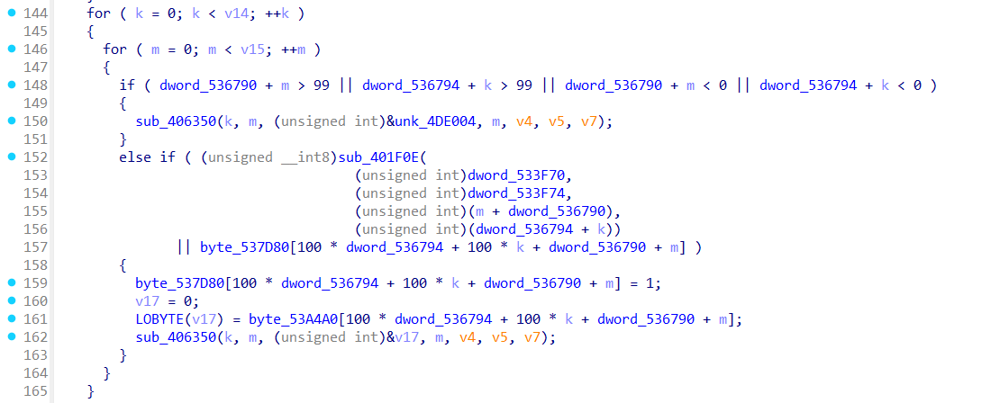
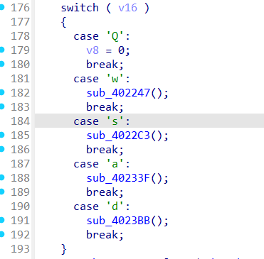
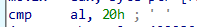
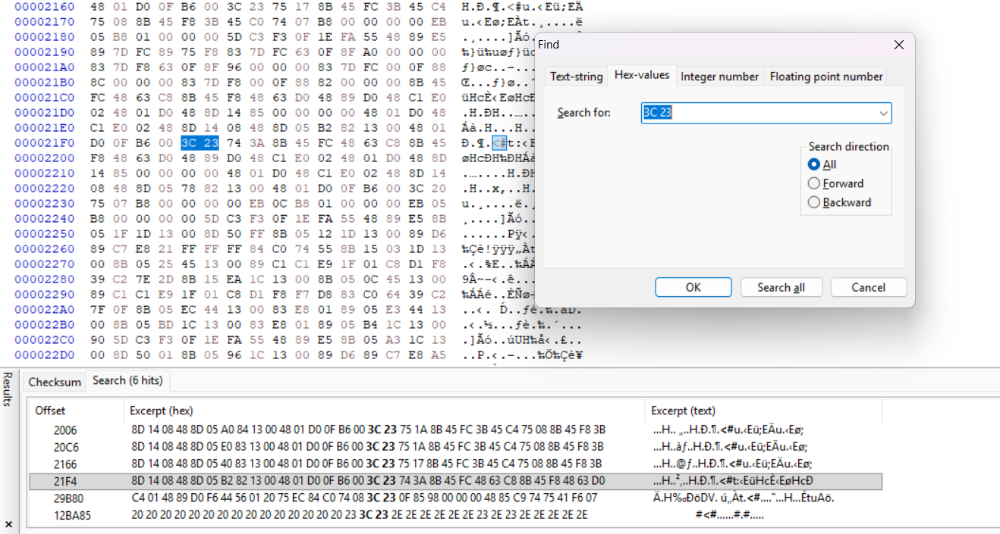
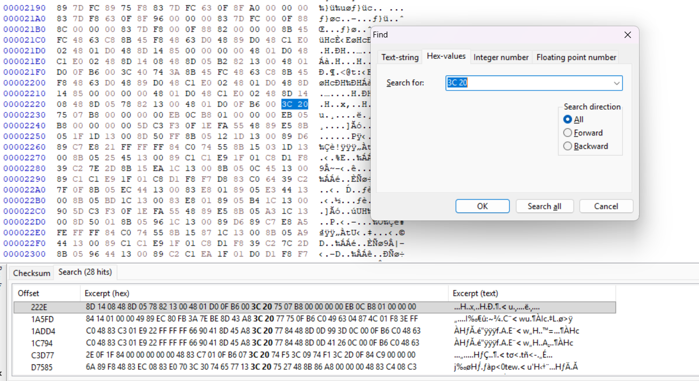

# Wizardlike
### Information
* Category: Reverse Engineering
* Point: 500
* Level: Hard

### Description
Do you seek your destiny in these deplorable dungeons? If so, you may want to look elsewhere. Many have gone before you and honestly, they've cleared out the place of all monsters, ne'erdowells, bandits and every other sort of evil foe. The dungeons themselves have seen better days too. There's a lot of missing floors and key passages blocked off. You'd have to be a real wizard to make any progress in this sorry excuse for a dungeon!
Download the game.
'w', 'a', 's', 'd' moves your character and 'Q' quits. You'll need to improvise some wizardly abilities to find the flag in this dungeon crawl. '.' is floor, '#' are walls, '<' are stairs up to previous level, and '>' are stairs down to next level.

### Hint
* Different tools are better at different things. Ghidra is awesome at static analysis, but radare2 is amazing at debugging.
* With the right focus and preparation, you can teleport to anywhere on the map.

## Solution:
Open the file `game` in IDA and navigate to `start` function. We can see the code loads 3 functions `sub_4242F0`, `sub_424250`, `sub_402437` and then call `sub_4235F0`.

Coming to function `sub_402437` and decompile it, we found the code that is most likely the game's core function, which contains maps rendering and player's movement:

### Map rendering:

### Player's movement:

From the map rendering code we know that the flag is dynamically rendered at each level and we need to get close for the flag to appeared, to do that, we need to go through walls and empty floors. After examining each function responsible for the player's movement, we found that function `sub_402188` is called in every movement made by the player:

This function checks whether the player is outside the 100×100 map or hit the wall (`#`) or empty floor (` `). Our goal is to patch the check by replacing them with `@` so that our player can go through the wall and empty floor to see the flag.

Search for the function named `sub_402188` in IDA window, we can get the assembly code that performs the check:

From ChatGPT, we know that `cmp al, 23h` is `3C 23` in opcode and `cmp al, 20h` is `3C 20`. So open `game` in HxD and search for `3C 23` first by pressing `Ctrl + F`, since `sub_402188` has offset `0x2188`, we want to find it near the address too:

Change 20 to 40 and move on to `3C 20`:

Change 20 to 40 again and press `Ctrl + S` to save the changes, we can verify whether the patch is succeed by open `game` in IDA again, navigate to function `sub_402188`, we see that our patch is correctly replacing the walls and empty floors check with `@` now:

Now we can open `game` and see that we can go through walls and empty floors.

After 10 levels, we got the flag `picoCTF{ur_4_w1z4rd_4844AD6f}`.

