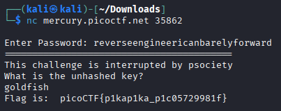

# GOGO
### Information
* Category: Reverse Engineering
* Level: Hard

### Description

Hmmm this is a weird file... `enter_password`. There is a instance of the service running at `mercury.picoctf.net:35862`.

### Hint

- use go tool objdump or ghidra

## Solution:

Open `enter_password` in IDA, go to the function `main_main` and decompile it.

```c
// main.main
void __golang main_main()
{
  _slice_interface__0 typ[2]; // [esp+0h] [ebp-58h] BYREF
  string *v1; // [esp+20h] [ebp-38h]
  string *p_string; // [esp+24h] [ebp-34h]
  _slice_interface__0 v3; // [esp+28h] [ebp-30h] BYREF
  string_0 *v4; // [esp+34h] [ebp-24h]
  _DWORD v5[2]; // [esp+38h] [ebp-20h] BYREF
  _DWORD v6[2]; // [esp+40h] [ebp-18h] BYREF
  _slice_interface__0 v7; // [esp+48h] [ebp-10h] BYREF
  string *v8; // [esp+54h] [ebp-4h]

  p_string = (string *)runtime_newobject((runtime__type_0 *)&RTYPE_string);
  typ[0].array = (interface__0 *)"Enter Password: ";
  typ[0].len = 16;
  memset(&typ[0].cap, 0, sizeof(_slice_interface__0));
  fmt_Printf(*(string_0 *)&typ[0].array, *(_slice_interface__0 *)&typ[0].cap);
  v6[0] = &RTYPE__ptr_string;
  v6[1] = p_string;
  typ[0].array = (interface__0 *)"%s\n";
  typ[0].len = 3;
  typ[0].cap = (int)v6;
  *(_QWORD *)&typ[1].array = 0x100000001LL;
  fmt_Scanf(*(string_0 *)&typ[0].array, *(_slice_interface__0 *)&typ[0].cap);
  if ( main_checkPassword(*(string_0 *)p_string) )
  {
    v5[0] = &RTYPE_string;
    v5[1] = &main_statictmp_0;
    typ[0].array = (interface__0 *)v5;
    *(_QWORD *)&typ[0].len = 0x100000001LL;
    fmt_Println(typ[0]);
    v3.cap = (int)&RTYPE_string;
    v4 = &main_statictmp_1;
    typ[0].array = (interface__0 *)&v3.cap;
    *(_QWORD *)&typ[0].len = 0x100000001LL;
    fmt_Println(typ[0]);
    v3.array = (interface__0 *)&RTYPE_string;
    v3.len = (int)&main_statictmp_2;
    typ[0].array = (interface__0 *)&v3;
    *(_QWORD *)&typ[0].len = 0x100000001LL;
    fmt_Println(typ[0]);
    v1 = (string *)runtime_newobject((runtime__type_0 *)&RTYPE_string);
    v7.cap = (int)&RTYPE__ptr_string;
    v8 = v1;
    typ[0].array = (interface__0 *)"%s\n";
    typ[0].len = 3;
    typ[0].cap = (int)&v7.cap;
    *(_QWORD *)&typ[1].array = 0x100000001LL;
    fmt_Scanf(*(string_0 *)&typ[0].array, *(_slice_interface__0 *)&typ[0].cap);
    main_ambush(*(string_0 *)v1);
    runtime_deferproc(0, (runtime_funcval_0 *)&stru_81046A0);
  }
  else
  {
    v7.array = (interface__0 *)&RTYPE_string;
    v7.len = (int)&main_statictmp_3;
    typ[0].array = (interface__0 *)&v7;
    *(_QWORD *)&typ[0].len = 0x100000001LL;
    fmt_Println(typ[0]);
  }
  runtime_deferreturn((uintptr)typ[0].array);
}
```

Although the function looks messy, it only does these things: `print("Enter Password: ") -> get input -> main_checkPassword(input) -> print("some strings after main_checkPassword returns true") -> get another input -> main_ambush(input) -> open("flag.txt") -> print(flag)`.

Step into `main_checkPassword`, we see that it defines a key `861836f13e3d627dfa375bdb8389214e`. The function then performs a loop that XOR each character of the key with the input and compares it to the corresponding character in `v4`. If equal, it increases `correct_bytes` by `1`. After the loop, it returns whether the `correct_bytes` is `32`. So to pass this function, we have to provide an input that when XORed with the key is equal to `v4`.

```c
// main.checkPassword
bool __golang main_checkPassword(string_0 input)
{
  int v1; // eax
  int correct_bytes; // ebx
  uint8 key[32]; // [esp+4h] [ebp-40h] BYREF
  _BYTE v4[32]; // [esp+24h] [ebp-20h]

  if ( input.len < 32 )
    os_Exit(0);
  ((void (*)(void))loc_8090B18)();
  qmemcpy(key, "861836f13e3d627dfa375bdb8389214e", sizeof(key));
  ((void (*)(void))loc_8090FE0)();
  v1 = 0;
  correct_bytes = 0;
  while ( v1 < 32 )
  {
    if ( (unsigned int)v1 >= input.len || (unsigned int)v1 >= 0x20 )
      runtime_panicindex();
    if ( (key[v1] ^ input.str[v1]) == v4[v1] )  // key[i] ^ input[i] == result[i]
      ++correct_bytes;
    ++v1;
  }
  return correct_bytes == 32;
}
```

Double click on `v4` to view it in the stack, we see that it points to `var_20` array.

```c
-0000000000000044     int code;
-0000000000000040     uint8 key[32];
-0000000000000020     _BYTE var_20[32];
+0000000000000000     _UNKNOWN *__return_address;
+0000000000000004     string_0 input;
+000000000000000C     bool _r1;
```

View the function in assembly, press `Space` to disable graph view. The function loads `var_20` memory to `edi`, `main_statictmp_4` to `esi`, and call `loc_8090FE0` to copy `esi` to `edi`. Overall, the function is loading the data for `v4` array. 

```asm
.text:080D4AF1                 lea     edi, [esp+44h+var_20]
.text:080D4AF5                 lea     esi, main_statictmp_4
.text:080D4AFB                 call    loc_8090FE0
```

Double click on `main_statictmp_4`, it is the 32-size array that contains our needed bytes.

```asm
.rodata:0810FE00 ; uint8 main_statictmp_4[32]
.rodata:0810FE00 main_statictmp_4 db 4Ah, 53h, 47h, 5Dh, 41h, 45h, 3, 54h, 5Dh, 2, 5Ah, 0Ah
.rodata:0810FE00                                         ; DATA XREF: main_checkPassword+75↑o
.rodata:0810FE0C                 db 53h, 57h, 45h, 0Dh, 5, 0, 5Dh, 55h, 54h, 10h, 1, 0Eh
.rodata:0810FE18                 db 41h, 55h, 57h, 4Bh, 45h, 50h, 46h, 1
```

With `key` and `v4` given, we can write a python script to find the input for us.

```py
# The hardcoded key from the decompiled code
HARDCODED_KEY = b"861836f13e3d627dfa375bdb8389214e"

# These are the secret bytes you extracted from the .rodata section
SECRET_BYTES = [
    0x4A, 0x53, 0x47, 0x5D, 0x41, 0x45, 0x03, 0x54, 
    0x5D, 0x02, 0x5A, 0x0A, 0x53, 0x57, 0x45, 0x0D, 
    0x05, 0x00, 0x5D, 0x55, 0x54, 0x10, 0x01, 0x0E, 
    0x41, 0x55, 0x57, 0x4B, 0x45, 0x50, 0x46, 0x01
]

password = ""
# Loop 32 times, once for each character
for i in range(32):
    # The formula: password_char = secret_byte ^ key_char
    password_char_code = SECRET_BYTES[i] ^ HARDCODED_KEY[i]
    
    # Convert the resulting byte code into a character
    password += chr(password_char_code)

print("The correct password is:")
print(password)
```

Run the script and we got our pass `reverseengineericanbarelyforward`. 

Continue exploring `main_main` function, we see that after it has checked the password, it prints some strings, get another input and call `main_ambush`, which hashes our input and compares it with `861836f13e3d627dfa375bdb8389214e`.

```c
// main.ambush
void __golang main_ambush(string_0 a)
{
  int j; // eax
  _slice_uint8_0 buf; // [esp+0h] [ebp-94h]
  _slice_uint8_0 s; // [esp+4h] [ebp-90h]
  _slice_uint8_0 dataa; // [esp+Ch] [ebp-88h]
  string_0 data; // [esp+Ch] [ebp-88h]
  string_0 data_4; // [esp+10h] [ebp-84h]
  uint8 v7; // [esp+1Fh] [ebp-75h]
  unsigned int i; // [esp+20h] [ebp-74h]
  uint8 hashed[16]; // [esp+24h] [ebp-70h] BYREF
  uint8 key[32]; // [esp+34h] [ebp-60h] BYREF
  uint8 v11[32]; // [esp+54h] [ebp-40h] BYREF
  uint8 v12[32]; // [esp+74h] [ebp-20h] BYREF

  dataa = runtime_stringtoslicebyte((uint8 (*)[32])v11, a);
  crypto_md5_Sum(dataa);                        // hash md5 the input
  ((void (*)(void))loc_8091008)();
  ((void (*)(void))loc_8090B18)();
  qmemcpy(key, "861836f13e3d627dfa375bdb8389214e", sizeof(key));
  for ( j = 0; j < 16; j = i + 1 )
  {
    i = j;
    buf.array = hashed;
    *(_QWORD *)&buf.len = 0x1000000010LL;
    data = encoding_hex_EncodeToString(buf);
    if ( i >= data.len
      || (v7 = data.str[i],
          s.array = key,
          *(_QWORD *)&s.len = 0x2000000020LL,
          data_4 = runtime_slicebytetostring((uint8 (*)[32])v12, s),
          i >= data_4.len) )
    {
      runtime_panicindex();
    }
    if ( v7 != data_4.str[i] )                  // hashed_input[i] != key[i]
      os_Exit(0);
  }
}
```

So we need to provide an input that when being hashed with md5, it provides the output is exact `861836f13e3d627dfa375bdb8389214e`. Because brute-forcing this is quite impossible, so we will go to [Crack Station](https://crackstation.net/) and submit the hash. Luckily the web does find the input, which is `goldfish`. 

After our analysis, we found out two passwords, `reverseengineericanbarelyforward` and `goldfish`. Submit these two strings and we got our flag `picoCTF{p1kap1ka_p1c05729981f}`.

